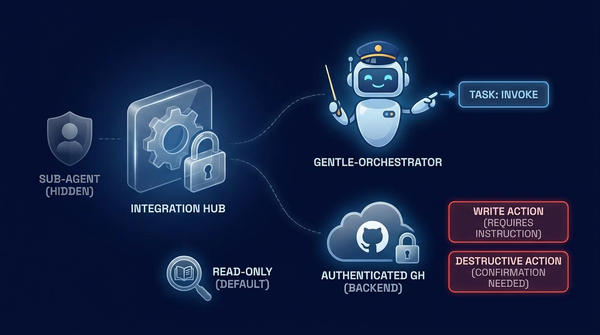
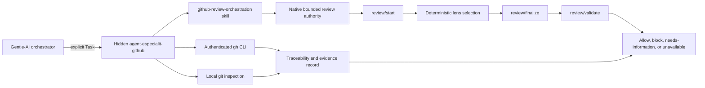
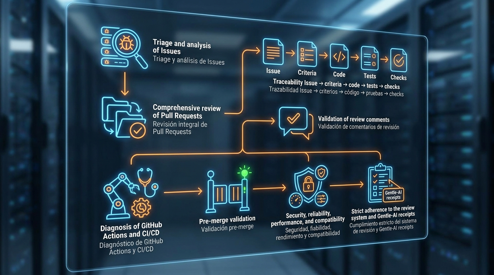
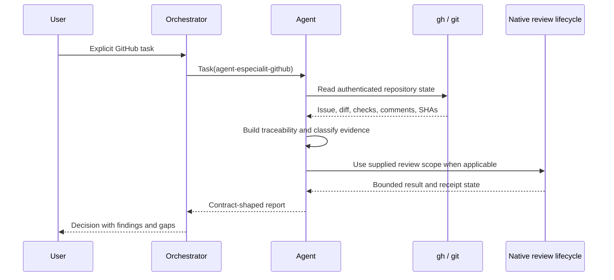
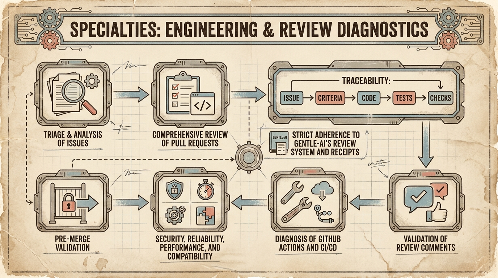
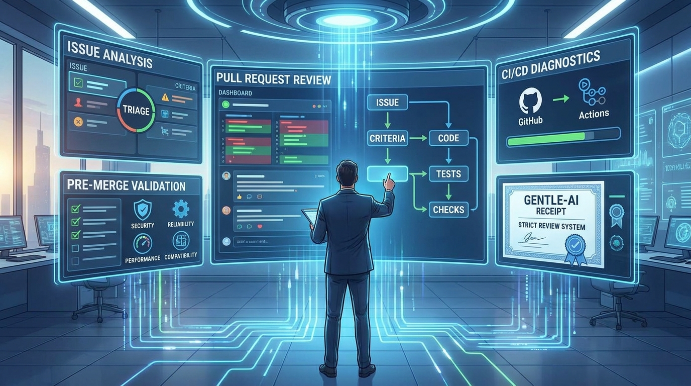

# Agent-especialit-GitHub

**On-Demand GitHub Review Orchestrator for Gentle-AI and OpenCode**

The hidden `agent-especialit-github` subagent gives a Gentle-AI/OpenCode
orchestrator a focused, evidence-first GitHub capability for Issues, pull
requests, reviews, comments, CI/CD diagnostics, traceability, and safe
pre-merge decisions. It is invoked explicitly through OpenCode `Task`; it
does not auto-activate and it does not replace native Gentle-AI review
authority.

> **Publication status:** This is a local repository package prepared for
> publication. It is not claimed to be published until its owner creates and
> publishes the remote repository.

## Value At A Glance

| Need | What this package provides |
| --- | --- |
| GitHub context | Authenticated `gh` is the default verified live backend. |
| Review discipline | Native bounded review remains the only review authority. |
| Traceability | Issue -> acceptance criteria -> code -> tests/checks -> decision. |
| Safety | Read-only by default; destructive and GitHub writes require explicit authorization. |
| Honest evidence | Every claim is `verified`, `inferred`, `not checked`, or `unavailable`. |
| Portable installation | Agent, skill, permission snippet, and docs ship together. |

## Quick Start

1. Copy `agent/agent-especialit-github.md` into your OpenCode agent directory.
2. Copy `skills/github-review-orchestration/SKILL.md` into your OpenCode skills directory.
3. Merge the minimal allow-list in [the permission example](examples/opencode-permission.jsonc) into the `gentle-orchestrator` configuration.
4. Restart OpenCode. Configuration-time agent and permission files are read at startup.
5. Ask the orchestrator to invoke `agent-especialit-github` with an explicit Task and a bounded GitHub scope.

See [Installation](docs/installation.md) for platform-neutral paths and checks.

## What It Does

| Workflow | Inspect | Decision output |
| --- | --- | --- |
| Issue triage | Body, template fields, duplicates, labels, discussion | Valid, in scope, actionable, approval state |
| PR review/readiness | Linked Issue, diff, base/head, reviews, checks, receipt | Findings and allow/block/needs-information/unavailable |
| Comment remediation | Exact thread, changed location, code, tests | Fixed, disproved with evidence, or still open |
| CI/check diagnosis | Suite, failing job, first actionable error, commit | Code, workflow, infrastructure, flaky, or unavailable |
| Pre-merge validation | Immutable SHA, branch relation, checks, approvals, conflicts | Safe recommendation only when required gates pass |

## Architecture

The agent is deliberately narrow. It gathers live evidence and renders a
decision; it does not create a second ledger, receipt, budget, or review
authority. The high-risk 4R set (`review-risk`, `review-resilience`,
`review-readability`, `review-reliability`) runs only inside one explicit
native `review/start` lifecycle. There is no uncontrolled reviewer fan-out.

## End-To-End Workflow

## Safety Model

- `hidden: true` keeps the specialist out of automatic discovery and normal agent selection.
- `mode: subagent` makes it a subordinate worker, never a primary conversational agent.
- `task: deny` prevents it from spawning more agents and creating uncontrolled recursion.
- `edit: deny` and `write: deny` prevent tool-level local file mutation, but do not by themselves prevent shell mutation.
- Ordered Bash rules allow only focused read-only `gh` and `git` commands; unknown or write commands ask for confirmation.
- GitHub writes, approvals, labels, reruns, comments, merges, closes, deletes, dismissals, conflict resolution, and force-pushes require explicit instruction; destructive actions also require confirmation.
- No tokens, cookies, secrets, or unverified GitHub MCP configuration are included.

## Evidence And Decisions

Evidence states are not interchangeable:

| State | Meaning |
| --- | --- |
| `verified` | Directly supported by command output, authoritative GitHub state, source evidence, or a checked SHA. |
| `inferred` | A reasoned interpretation that still needs direct confirmation. |
| `not checked` | The agent did not inspect the relevant source or state. |
| `unavailable` | Access, permission, network, or backend limitations prevented inspection. |

Severity is `BLOCKER`, `CRITICAL`, `WARNING`, or `SUGGESTION`. A severe finding
blocks only when candidate-causal evidence proves it was introduced,
behavior-activated, or worsened by the candidate. `pre-existing`, `base-only`,
and unresolved `unknown` findings are reported with their appropriate status;
preferences are never promoted into blockers.

## Installation And Examples

- [Installation guide](docs/installation.md)
- [Architecture](docs/architecture.md)
- [Workflows](docs/workflows.md)
- [Output contract](docs/output-contract.md)
- [Security model](docs/security-model.md)
- [Practical Task prompts](examples/task-prompts.md)
- [Example output](examples/review-output.md)
- [Permission snippet](examples/opencode-permission.jsonc)

## Bundled Components

| Component | Path | Purpose |
| --- | --- | --- |
| Agent definition | [agent/agent-especialit-github.md](agent/agent-especialit-github.md) | Hidden, explicit-Task GitHub specialist |
| Composite skill | [skills/github-review-orchestration/SKILL.md](skills/github-review-orchestration/SKILL.md) | Evidence and workflow rules |
| Permission example | [examples/opencode-permission.jsonc](examples/opencode-permission.jsonc) | Minimal `Task` allow-list |
| Documentation | [docs/](docs/) | Installation, design, operations, and contracts |

The complete skill inventory, including external recommendations and backend
references, is in [the skills catalog](docs/skills-catalog.md). External links
are references only; no external package is claimed to be installed.

## Roadmap

The initial release focuses on portable packaging and safe read-oriented
orchestration. Possible follow-ups are documented in [the roadmap](docs/roadmap.md).

## Contributing

Read [CONTRIBUTING.md](CONTRIBUTING.md), preserve the output and safety
contracts, and include verification evidence for documentation or configuration
changes. Please do not add secrets, fake CI claims, or unverified integrations.

## License

Licensed under [Apache-2.0](LICENSE). See [CHANGELOG.md](CHANGELOG.md) for the
initial `1.0.0` release notes and [docs/image-catalog.md](docs/image-catalog.md)
for the image source mapping.
