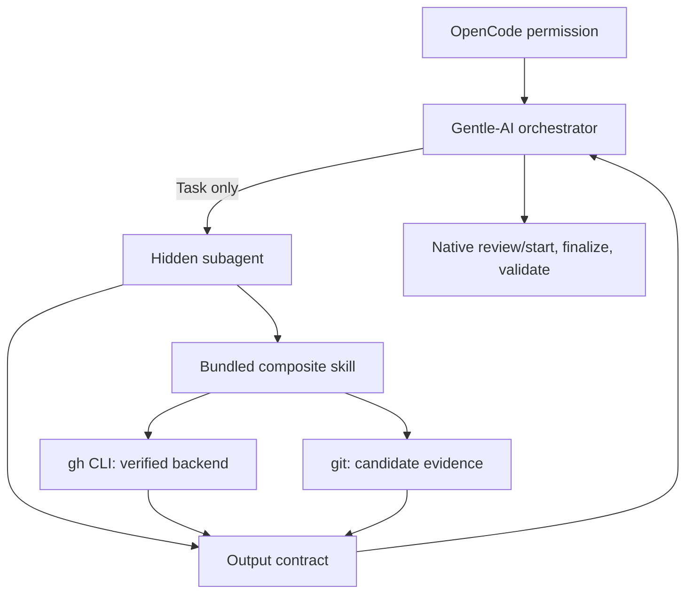

# Architecture

## Boundary

The package has three runtime pieces: an explicit-Task agent, a composite
GitHub evidence skill, and the host orchestrator's permission allow-list. The
agent reads GitHub and local candidate state; the native review system owns
review authority.

## Why Hidden And Bounded

`hidden: true` prevents accidental activation. `mode: subagent` prevents the
specialist from acting as the primary user-facing agent. `task: deny` blocks
recursive delegation. `edit: deny` and `write: deny` keep local changes out of
scope. Bash remains available for focused `gh` and `git` inspection, not as a
license for mutation.

## Review Authority

The native route is deterministic: `review/start` freezes scope, risk tier,
lenses, and budget; the selected result is finalized; the same receipt is
validated at lifecycle gates. Low-risk documentation-only changes use no lens.
Standard changes use exactly one dominant-risk lens. High-risk security,
permissions, data exposure/loss, shell/process integration, or over-400-line
changes use the canonical 4R set, and only inside that one explicit start.

## Integration Direction

The agent depends on the skill and host CLI. The skill depends on named local
contracts when present. Neither creates a competing review ledger or authority.
