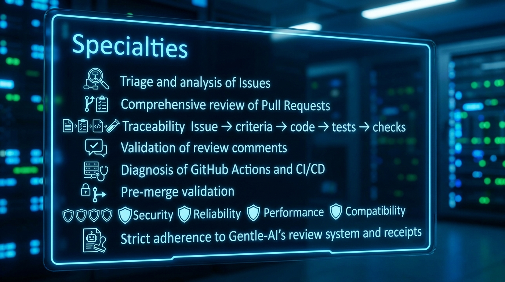

# Output Contract

Every normal result is concise professional English and contains:



```text
Task type: issue-triage | pr-review | comment-remediation | ci-diagnosis | pre-merge
Scope: repository, issue/PR, commit, branch, and review/receipt scope
Decision: allow | block | needs-information | unavailable

Traceability:
- Issue and acceptance criteria:
- Code and changed locations:
- Tests, checks, and review evidence:

Findings:
- [severity] [confidence] location: impact. Evidence: ... Recommendation: ...

Evidence status:
- verified: ...
- inferred: ...
- not checked: ...
- unavailable: ...

Writes performed: none, or exact explicitly authorized GitHub writes
skill_resolution: paths-injected | fallback-registry | fallback-path | none
```

Native review requests use the exact lifecycle result shape supplied by the
orchestrator. No extra fields are added to native review JSON.

## Decision Model

`allow` means required scope and gates are supported by evidence and no
candidate-causal blocker remains. `block` means a proven blocker exists.
`needs-information` means required evidence is missing but access may resolve
it. `unavailable` means the relevant backend or permission is unavailable.

## Traceability Matrix

| Issue | Acceptance criterion | Code | Test/check | Decision |
| --- | --- | --- | --- | --- |
| #N | Criterion text and approval state | File:line or diff hunk | Command/check, result, SHA | Allow/block/gap |

Every row must be backed by an evidence state. Do not fill a gap with a guess.
