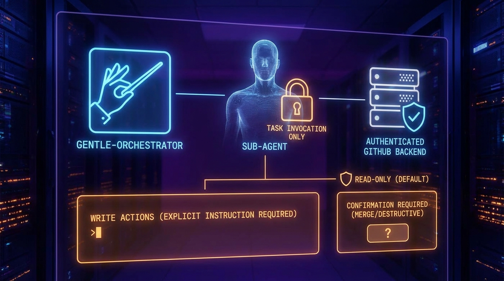

# Security Model

## Defaults

- `gh` is the default verified backend.
- Read first; write only when explicitly authorized.
- Never print or persist tokens, cookies, secret values, or sensitive command output.
- Never configure an unverified GitHub MCP.
- Never merge, close, delete, dismiss, resolve, rerun, rollback, or force-push on inference.

## Permissions

The host permission grants only explicit Task routing to the named agent. The
agent denies local edit/write/task actions. Bash access is constrained by the
mission and operating rules, so command choice must remain focused and
read-oriented.

## Threats And Responses

| Threat | Response |
| --- | --- |
| Secret exposure | Redact output; never include credentials in prompts, docs, or examples. |
| Untrusted workflow input | Inspect triggers, permissions, and untrusted data before a security decision. |
| False success | Require command, source, GitHub, or SHA evidence and label its state. |
| Review authority drift | Use only native `review/start` -> finalize -> validate. |
| Accidental mutation | Explicit authorization plus confirmation for destructive actions. |
| Backend uncertainty | Use `gh`; report MCP or permission limitations as unavailable. |
