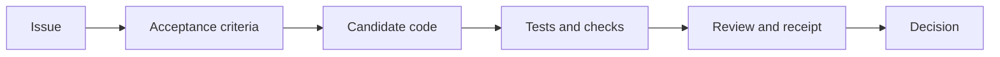

# Workflows

## Issue To Decision

| Step | Required evidence | Missing evidence means |
| --- | --- | --- |
| Issue | Number, body, fields, duplicates, labels, state | `needs-information` |
| Criteria | Explicit or extracted acceptance conditions | Gap recorded, no invented criteria |
| Code | Diff location, base/head SHA | Candidate scope is incomplete |
| Verification | Test/check name, command or URL, SHA | `not checked` or `unavailable` |
| Decision | Severity, confidence, causal status, receipt | No safe allow recommendation |

## Read-Only Inspection

Start with `gh auth status`, repository metadata, and the narrow resource
needed. Use `gh pr diff`, `gh pr checks`, `gh run view --log-failed`, and
`git diff --check` as appropriate. Redact sensitive output.

## Authorized Writes

Comments, labels, approvals, reruns, edits, merges, closes, and deletes are
writes. The task must explicitly name the operation and scope. Merge, close,
delete, dismissal, conflict resolution, rollback, and force-push also require
confirmation. Never infer authorization from a request to review.

## CI And Conflicts

Classify CI failures as code, workflow syntax, permissions, runner/environment,
cancelled, queued, flaky, or unavailable. For conflicts, report base/head SHAs
and paths; do not resolve, rebase, or push.

## Native Review Lifecycle

The specialist participates only when the orchestrator supplies a native review
scope. It never launches a parallel lens set, refuter, or Judgment Day. The
extraordinary `judgment-day` path is reserved for explicit extraordinary review.
